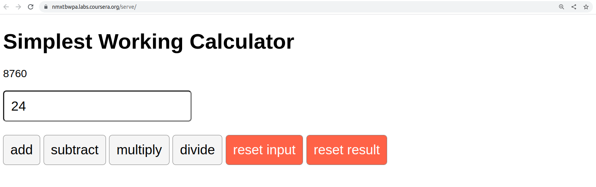

# Task
For this assessment, you will be building a calculator in React. Your task is to build a calculator app that can perform the four basic mathematical operations: addition, subtraction, multiplication, and division.

# Example of the calculator
